# ERD — COTIZADOR WEB MERCADO PRIMARIO

> **Motor:** SQLite embebido
> **DDL completo:** [scripts/schema.sql](scripts/schema.sql)
> **Modelo documentado:** [MODELO_DATOS_COTIZADOR.md](MODELO_DATOS_COTIZADOR.md)
> **Renderizado:** VSCode con extensión *Markdown Preview Mermaid Support*, GitHub, Notion, GitLab

---

## DIAGRAMA ENTIDAD-RELACIÓN

```mermaid
erDiagram

    %% ── ENTIDADES PRINCIPALES ──────────────────────────────

    INMOBILIARIA {
        INTEGER id_inmobiliaria   PK  "Surrogate key"
        TEXT    nombre            UK  "INGEVEC / MAESTRA / RVC / TOCTOC / URMENETA"
        INTEGER activo                "0=inactiva  1=activa (baja lógica)"
        TEXT    created_at
        TEXT    updated_at
    }

    PROYECTO {
        INTEGER id_proyecto       PK  "Surrogate key"
        INTEGER id_inmobiliaria   FK  "→ INMOBILIARIA"
        TEXT    nemotecnico       UK  "Clave natural: ABD, TOC, BEL…"
        TEXT    nombre_proyecto
        TEXT    comuna
        TEXT    direccion
        TEXT    tipo_entrega          "Entrega Inmediata | Entrega Futura"
        TEXT    periodo_entrega        "Inmediata | 1er semestre 2028…"
        INTEGER activo                "0=inactivo  1=activo"
        TEXT    created_at
        TEXT    updated_at
    }

    UNIDAD {
        INTEGER id_unidad             PK  "Surrogate key (natural key no es única)"
        INTEGER id_proyecto           FK  "→ PROYECTO"
        INTEGER numero_unidad             "NULL para bodegas/estac sin número"
        TEXT    tipo_unidad               "Departamento | Estacionamiento | Bodega | Local…"
        TEXT    programa                  "2D1B | 1D1B | Bodega | Estacionamiento…"
        INTEGER piso_producto             "Incluye pisos negativos (-4 subterráneo)"
        TEXT    orientacion               "NORTE | SUR | ORIENTE | PONIENTE… (NULL ok)"
        TEXT    dormitorios               "1 | 2 | 3 | 1-1/2 | BO | NULL"
        INTEGER banios                    "1 | 2 | NULL"
        REAL    superficie_terreno_m2     "Casas; 0 para deptos/estac/bodegas"
        REAL    superficie_util_m2        "NULL para estac/bodegas; coma→punto en import"
        REAL    superficie_terraza_m2     "NULL para estac/bodegas; coma→punto en import"
        REAL    superficie_total_m2       "CHECK >= 0"
        REAL    precio_lista_uf           "CHECK > 0  —  en UF"
        TEXT    estado_stock              "Disponible | Arrendado | En Recolocación | Reservado"
        TEXT    bienes_conjuntos          "Texto crudo: B-1, B-1B… Resuelto en BIEN_CONJUNTO"
        TEXT    created_at
        TEXT    updated_at
    }

    CONDICION_COMERCIAL {
        INTEGER id_condicion              PK  "Surrogate key"
        INTEGER id_proyecto               FK  "→ PROYECTO"
        TEXT    tipo_unidad               UK  "(con id_proyecto y programa)"
        TEXT    programa                  UK  "(con id_proyecto y tipo_unidad)"
        INTEGER reserva_clp                   "CLP — ej: 100000  CHECK >= 0"
        REAL    descuento                     "Decimal [0,1] — ej: 0.10 = 10%"
        REAL    bono_pie                      "Decimal [0,1] — ej: 0.10 = 10%"
        INTEGER cuotas_pie                    "N° cuotas del saldo pie  CHECK >= 0"
        REAL    pie_periodo_construccion      "Decimal [0,1] — aplica en Entrega Futura"
        REAL    cuoton                        "Decimal [0,1]"
        REAL    pie_credito_directo           "Decimal [0,1]"
        INTEGER activo                        "0=inactiva  1=activa"
        TEXT    created_at
        TEXT    updated_at
    }

    BIEN_CONJUNTO {
        INTEGER id_bien_conjunto          PK  "Surrogate key"
        INTEGER id_unidad_principal       FK  "→ UNIDAD (Departamento)"
        INTEGER id_unidad_asociada        FK  "→ UNIDAD (Estacionamiento o Bodega)"
        TEXT    descripcion                   "Texto original para trazabilidad — NULL ok"
        TEXT    created_at
    }

    UF_VALOR {
        TEXT    fecha                     PK  "YYYY-MM-DD — un valor por día"
        REAL    valor_uf                      "CHECK > 0  —  en pesos CLP"
        REAL    variacion_diaria              "Diferencia respecto al día anterior — NULL ok"
        TEXT    created_at
    }

    PARAMETRO_COTIZADOR {
        INTEGER id_parametro              PK  "Surrogate key"
        TEXT    categoria                 UK  "(con clave): CAE | PIE_PCT | PLAZO | CONSTANTE"
        TEXT    clave                     UK  "(con categoria)"
        REAL    valor_numerico                "NULL para parámetros solo descriptivos"
        TEXT    etiqueta                      "Texto para mostrar en UI: 4.0%, 30 años…"
        INTEGER orden                         "Posición en dropdown"
        INTEGER es_default                    "1 = valor preseleccionado en UI"
        INTEGER activo                        "0=oculto  1=visible"
        TEXT    created_at
        TEXT    updated_at
    }

    COTIZACION {
        INTEGER id_cotizacion             PK  "Surrogate key"
        TEXT    fecha_generacion              "Timestamp ISO 8601"
        INTEGER id_unidad                 FK  "→ UNIDAD (snapshot)"
        INTEGER id_condicion              FK  "→ CONDICION_COMERCIAL (snapshot)"
        TEXT    nombre_broker
        TEXT    nombre_cliente
        TEXT    rut_cliente                   "NULL ok"
        TEXT    email_cliente                 "NULL ok"
        TEXT    celular_cliente               "NULL ok"
        REAL    valor_uf_snapshot             "UF del día de generación"
        REAL    pie_pct                       "% de pie usado"
        INTEGER n_cuotas_pie
        REAL    cae_1                         "Escenario 1 — ej: 0.040"
        REAL    cae_2                         "Escenario 2 — ej: 0.045"
        REAL    cae_3                         "Escenario 3 — ej: 0.050"
        INTEGER plazo_anios                   "20 | 25 | 30"
        INTEGER arriendo_1_clp                "NULL ok"
        INTEGER arriendo_2_clp                "NULL ok"
        INTEGER arriendo_3_clp                "NULL ok"
        REAL    plusvalia_anual_pct           "Default 0.02"
        REAL    precio_lista_uf               "Snapshot del precio al generar"
        REAL    precio_venta_uf               "Con descuento aplicado"
        REAL    tasacion_uf                   "NULL si bono_pie = 0"
        REAL    pie_total_uf
        REAL    ch_plan_uf                    "Base del PMT"
        REAL    roi_5anios                    "NULL ok"
        REAL    roi_anual                     "NULL ok"
        REAL    cap_rate                      "NULL ok"
    }

    %% ── RELACIONES FK FÍSICAS ───────────────────────────────

    INMOBILIARIA        ||--o{  PROYECTO            : "tiene  (1:N)"
    PROYECTO            ||--o{  UNIDAD              : "contiene  (1:N)"
    PROYECTO            ||--o{  CONDICION_COMERCIAL : "define  (1:N)"
    UNIDAD              ||--o{  BIEN_CONJUNTO        : "es Depto principal  (1:N)"
    UNIDAD              ||--o{  BIEN_CONJUNTO        : "es Estac/Bodega asociada  (1:N)"
    UNIDAD              ||--o{  COTIZACION           : "cotizada en  (1:N)"
    CONDICION_COMERCIAL ||--o{  COTIZACION           : "snapshot en  (1:N)"

    %% ── RELACIÓN LÓGICA (no FK física) ──────────────────────

    UNIDAD              }o..o{  CONDICION_COMERCIAL : "JOIN lógico via proyecto+tipo+programa"
```



---

## ÍNDICES Y CONSTRAINTS

### Claves primarias y únicas

| Tabla | PK | Claves Únicas (UK) |
|---|---|---|
| `inmobiliaria` | `id_inmobiliaria` | `nombre` |
| `proyecto` | `id_proyecto` | `nemotecnico` / `(id_inmobiliaria, nombre_proyecto)` |
| `unidad` | `id_unidad` | `(id_proyecto, tipo_unidad, numero_unidad)` **PARCIAL** `WHERE numero_unidad IS NOT NULL` |
| `condicion_comercial` | `id_condicion` | `(id_proyecto, tipo_unidad, programa)` |
| `bien_conjunto` | `id_bien_conjunto` | `(id_unidad_principal, id_unidad_asociada)` |
| `uf_valor` | `fecha` | *(PK es la UK)* |
| `parametro_cotizador` | `id_parametro` | `(categoria, clave)` |
| `cotizacion` | `id_cotizacion` | — |

### Claves foráneas

| Tabla | FK | Referencia | ON UPDATE | ON DELETE |
|---|---|---|---|---|
| `proyecto` | `id_inmobiliaria` | `inmobiliaria.id_inmobiliaria` | CASCADE | RESTRICT |
| `unidad` | `id_proyecto` | `proyecto.id_proyecto` | CASCADE | RESTRICT |
| `condicion_comercial` | `id_proyecto` | `proyecto.id_proyecto` | CASCADE | RESTRICT |
| `bien_conjunto` | `id_unidad_principal` | `unidad.id_unidad` | — | CASCADE |
| `bien_conjunto` | `id_unidad_asociada` | `unidad.id_unidad` | — | CASCADE |
| `cotizacion` | `id_unidad` | `unidad.id_unidad` | — | RESTRICT |
| `cotizacion` | `id_condicion` | `condicion_comercial.id_condicion` | — | RESTRICT |

### Índices de consulta

| Índice | Tabla | Columnas | Tipo | Propósito |
|---|---|---|---|---|
| `idx_proyecto_inmobiliaria` | proyecto | (id_inmobiliaria) | Normal | Lookup FK |
| `idx_proyecto_activo` | proyecto | (activo, id_inmobiliaria) | Normal | Filtro UI |
| `uq_unidad_por_proyecto` | unidad | (id_proyecto, tipo_unidad, numero_unidad) | Único parcial | Integridad sin bloquear NULLs |
| `idx_unidad_proyecto` | unidad | (id_proyecto) | Normal | Lookup FK |
| `idx_unidad_disponibles` | unidad | (id_proyecto, estado_stock, tipo_unidad) | Normal | Filtro cotizador |
| `idx_unidad_numero` | unidad | (numero_unidad) | Normal | Selección por N° unidad |
| `idx_unidad_precio` | unidad | (id_proyecto, precio_lista_uf) | Normal | Ordenamiento precio |
| `idx_unidad_condicion` | unidad | (id_proyecto, tipo_unidad, programa) | Normal | JOIN con condicion_comercial |
| `idx_condicion_proyecto` | condicion_comercial | (id_proyecto, activo) | Normal | Filtro por proyecto |
| `idx_condicion_join` | condicion_comercial | (id_proyecto, tipo_unidad, programa) WHERE activo=1 | Parcial | JOIN cotizador activo |
| `idx_bc_principal` | bien_conjunto | (id_unidad_principal) | Normal | Lookup bienes del depto |
| `idx_bc_asociada` | bien_conjunto | (id_unidad_asociada) | Normal | Lookup depto de un bien |
| `idx_uf_fecha_desc` | uf_valor | (fecha DESC) | Normal | Último valor UF |
| `idx_parametro_categoria` | parametro_cotizador | (categoria, activo) | Normal | Carga de dropdowns UI |
| `idx_cotizacion_unidad` | cotizacion | (id_unidad) | Normal | Historial por unidad |
| `idx_cotizacion_broker` | cotizacion | (nombre_broker, fecha_generacion DESC) | Normal | Historial por broker |
| `idx_cotizacion_fecha` | cotizacion | (fecha_generacion DESC) | Normal | Historial cronológico |

### CHECK constraints

| Tabla | Constraint | Regla |
|---|---|---|
| `inmobiliaria` | `chk_inmobiliaria_activo` | `activo IN (0,1)` |
| `proyecto` | `chk_proyecto_tipo_entrega` | `tipo_entrega IN ('Entrega Inmediata','Entrega Futura')` |
| `proyecto` | `chk_proyecto_activo` | `activo IN (0,1)` |
| `unidad` | `chk_unidad_tipo` | `tipo_unidad IN ('Departamento','Estacionamiento','Bodega','Local Comercial','Local comercial','Local','Estacionamiento Moto','Estacionamiento Comercial','Estacionamiento local')` |
| `unidad` | `chk_unidad_estado` | `estado_stock IN ('Disponible','Arrendado','En Recolocación','Reservado')` |
| `unidad` | `chk_unidad_precio` | `precio_lista_uf > 0` |
| `unidad` | `chk_unidad_sup` | `superficie_total_m2 >= 0` |
| `condicion_comercial` | `chk_condicion_reserva` | `reserva_clp >= 0` |
| `condicion_comercial` | `chk_condicion_descuento` | `descuento BETWEEN 0 AND 1` |
| `condicion_comercial` | `chk_condicion_bono_pie` | `bono_pie BETWEEN 0 AND 1` |
| `condicion_comercial` | `chk_condicion_cuotas` | `cuotas_pie >= 0` |
| `condicion_comercial` | `chk_condicion_pie_constr` | `pie_periodo_construccion BETWEEN 0 AND 1` |
| `condicion_comercial` | `chk_condicion_cuoton` | `cuoton BETWEEN 0 AND 1` |
| `condicion_comercial` | `chk_condicion_cred_dir` | `pie_credito_directo BETWEEN 0 AND 1` |
| `condicion_comercial` | `chk_condicion_activo` | `activo IN (0,1)` |
| `bien_conjunto` | `chk_bc_distintos` | `id_unidad_principal != id_unidad_asociada` |
| `uf_valor` | `chk_uf_valor` | `valor_uf > 0` |
| `parametro_cotizador` | `chk_param_categoria` | `categoria IN ('CAE','PIE_PCT','PLAZO','CONSTANTE')` |
| `parametro_cotizador` | `chk_param_default` | `es_default IN (0,1)` |
| `parametro_cotizador` | `chk_param_activo` | `activo IN (0,1)` |

---

## TRIGGERS (updated_at automático)

| Trigger | Tabla | Evento | Acción |
|---|---|---|---|
| `trg_inmobiliaria_upd` | inmobiliaria | AFTER UPDATE | `updated_at = datetime('now')` |
| `trg_proyecto_upd` | proyecto | AFTER UPDATE | `updated_at = datetime('now')` |
| `trg_unidad_upd` | unidad | AFTER UPDATE | `updated_at = datetime('now')` |
| `trg_condicion_upd` | condicion_comercial | AFTER UPDATE | `updated_at = datetime('now')` |
| `trg_parametro_upd` | parametro_cotizador | AFTER UPDATE | `updated_at = datetime('now')` |

---

## VISTA OPERATIVA

### `v_stock_cotizable`

JOIN que el cotizador consume directamente. Expone todas las columnas necesarias para calcular una cotización en una sola consulta.

```sql
-- Ejemplo de uso en el cotizador
SELECT * FROM v_stock_cotizable
WHERE alianza        = 'MAESTRA'
  AND nombre_proyecto = 'PLAZA CERVANTES I'
  AND tipo_unidad     = 'Departamento'
ORDER BY piso_producto, numero_unidad;
```

**Tablas combinadas:** `unidad` ⟕ `condicion_comercial` ⟕ `proyecto` ⟕ `inmobiliaria`
**Filtros fijos:** `estado_stock = 'Disponible'` y todos los `activo = 1`
**LEFT JOIN** en condicion_comercial: permite ver unidades aunque su condición esté pendiente de carga.

---

## VOLÚMENES DE DATOS (referencia)

| Tabla | Filas iniciales | Fuente | Frecuencia de actualización |
|---|---|---|---|
| `inmobiliaria` | 5 | Manual | Baja (solo al incorporar nueva alianza) |
| `proyecto` | 99 | Hoja PROYECTOS | Media (nuevos proyectos) |
| `unidad` | 8.646 | Hoja STOCK NUEVOS | Alta (actualizaciones de stock) |
| `condicion_comercial` | 309 | Hoja CONDICIONES_COMERCIALES | Media (cambios comerciales) |
| `bien_conjunto` | ~409 | Derivada de STOCK NUEVOS | Con cada actualización de stock |
| `uf_valor` | 17.784 | Hoja UF / API CMF | Diaria (1 fila/día) |
| `parametro_cotizador` | 22 | Hoja aux + constantes | Muy baja (solo admin senior) |
| `cotizacion` | 0 (inicio) | Generada por la app | Con cada cotización creada |

---

## NOTAS DE DISEÑO

### Relación lógica unidad ↔ condicion_comercial
No existe FK física entre estas tablas porque una condición aplica a **múltiples unidades** del mismo programa. El JOIN en tiempo de ejecución usa tres columnas:
```sql
unidad.id_proyecto  = condicion_comercial.id_proyecto
AND unidad.tipo_unidad = condicion_comercial.tipo_unidad
AND unidad.programa    = condicion_comercial.programa
```

### Índice único parcial en unidad
`numero_unidad` puede ser NULL (916 casos en el stock inicial: bodegas y estacionamientos sin número asignado). El índice único parcial `WHERE numero_unidad IS NOT NULL` garantiza que no existan duplicados reales mientras permite múltiples NULLs.

### Surrogate PK en unidad
La combinación `(nemotecnico + tipo_unidad + numero_unidad)` presenta 73 duplicados en el stock de origen porque distintos tipos de unidad (Depto, Estac, Bodega) comparten números dentro del mismo proyecto. El `id_unidad` surrogate resuelve esto de forma limpia.

### bien_conjunto — dos FK a la misma tabla
La tabla implementa una relación reflexiva sobre `unidad`:
- `id_unidad_principal` → siempre un **Departamento**
- `id_unidad_asociada` → siempre un **Estacionamiento** o **Bodega**
El CHECK `id_unidad_principal != id_unidad_asociada` previene auto-referencias.

### SUPERFICIE_TERRENO
Actualmente vacía en el stock de departamentos — se importa como `0`. El campo está reservado para uso futuro con **Casas**, donde registra la superficie del terreno en m².

### Normalización de ESTADO STOCK
El stock de origen contiene `'DISPONIBLE'` (677 registros, en mayúsculas) junto a `'Disponible'`. El proceso de importación debe normalizar a `'Disponible'` antes del INSERT para satisfacer el CHECK constraint.
